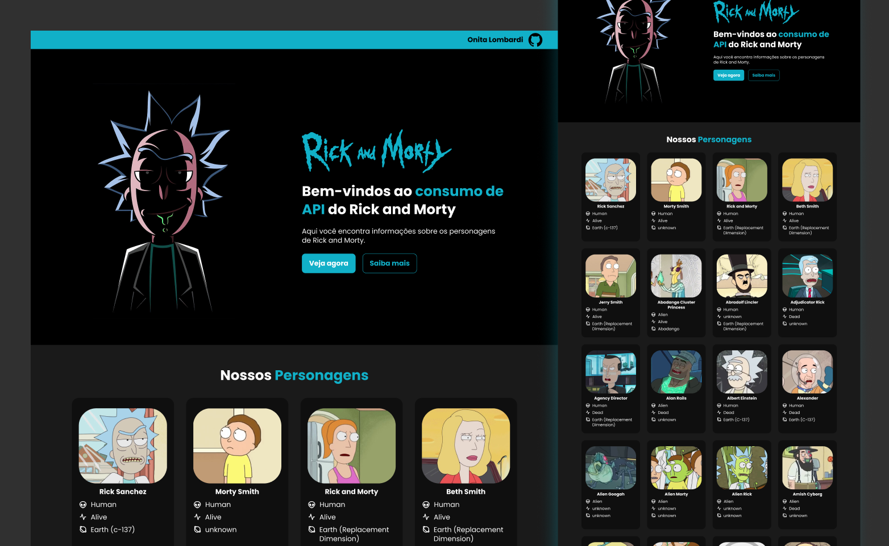

<h1 align="center"> 
	   Rick And Morty - Concluído 
</h1>

 <a href="#-descrição-do-entregável">Descrição do entregável</a> •
 <a href="#-sobre-o-projeto">Sobre</a> •
 <a href="#-layout">Layout</a> • 
 <a href="#-como-executar-o-projeto">Como executar</a> • 
 <a href="#-tecnologias">Tecnologias</a> • 
 <a href="#-autor">Autor</a>

## 📄 Descrição do entregável

- src (Estrutura geral do projeto: imagens, estilos, etc.)

- index.html (Arquivo principal do projeto)

## 💻 Sobre o projeto

Rick and Morty é um projeto desenvolvido durante o curso de Desenvolvedor Front-End para praticar o consumo de APIs com JavaScript. A aplicação utiliza a API pública de Rick and Morty para exibir informações sobre personagens da série.

## 🎨 Layout

## 🚀 Como executar o projeto

1 - Clonar este repositório ou baixar o projeto  
2 - Executar o arquivo `index.html`

### Pré-requisitos

Antes de começar, você precisará das seguintes ferramentas:
- Um navegador atualizado (Google Chrome, Edge, Firefox, etc.)
- Um editor de código, como [VSCode](https://code.visualstudio.com/).

## 🛠 Tecnologias

As seguintes tecnologias foram usadas no desenvolvimento do projeto:

#### **Front-end**

- **HTML**
- **CSS**
- **JavaScript**

#### **Prototipação** ([Figma](https://www.figma.com/))

## 🦸 Autor

<a href="https://www.linkedin.com/in/onita-lombardi">Onita Lombardi</a>

 

